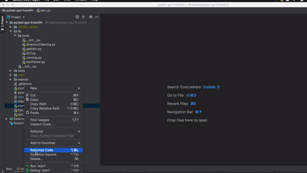

## GUI for Pytest based on appJar.
#### Clone project:
```
git clone https://github.com/vsshk/pytest-gui.git
cd pytest-gui
```
### install requirements and Allure
```
$ pip install -r requirements.txt 
```
* [install Allure](https://docs.qameta.io/allure/)
* 
# How to run?
```
$ python start.py
```
* Please give a "star" if it helped you.
### All tests exist in verification purposes only.
### Be Free to delete whole list from directory.
test_example_func_only.py::test_junk
test_example_func_only.py::test_boom
test_example_module_with_class.py::TestClass::test_inclass_one
test_example_module_with_class.py::TestClass::test_inclass_two
tests/coverage/flash/KO/test_knok.py::TestClass::test_Knoks
tests/coverage/flash/KO/test_knok.py::TestClass::test_Knoks__zero
tests/coverage/flash/KO/test_knok.py::TestClassz::test_Knoks
tests/coverage/flash/KO/test_knok.py::TestClassz::test_Knoks__zero
tests/coverage/flash/KO/test_knok_zooma.py::TestClass::test_Knoks
tests/coverage/flash/KO/test_knok_zooma.py::TestClass::test_Knoks__zero
tests/coverage/flash/KO/test_knok_zooma.py::TestClassz::test_Knoks
tests/coverage/flash/KO/test_knok_zooma.py::TestClassz::test_Knoks__zero
tests/coverage/flash/KO/test_knok_zooma.py::test_buy
tests/coverage/flash/test_flash.py::test_abs
tests/coverage/test_appium.py::test_one
tests/coverage/test_booma.py::test_one
tests/coverage/test_zangetcy.py::TestClass::test_inclas
tests/test_junk.py::test_junk
tests/test_junk.py::test_jun_sec"
